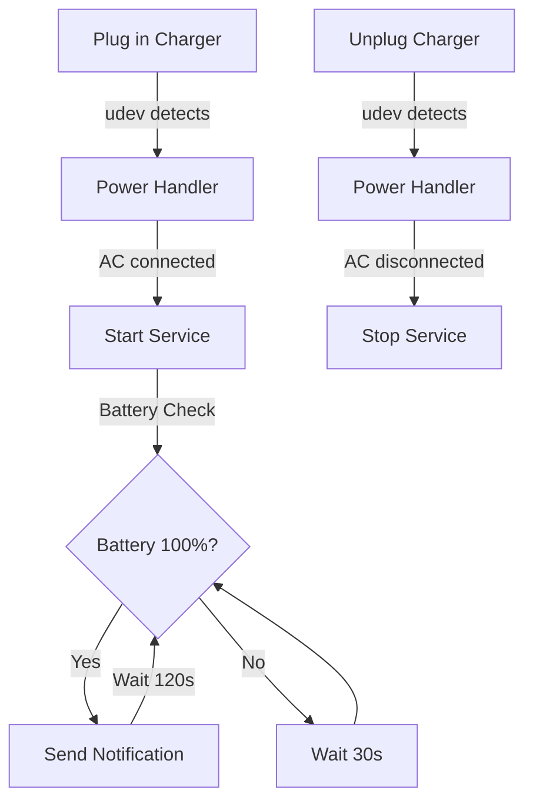

# Linux Battery Notification System

A lightweight system that monitors your laptop's battery and sends notifications when the battery is fully charged while plugged in. The system automatically starts when you plug in your charger and stops when you unplug it.

## Features

- 🔌 Automatic start/stop based on charger connection
- 🔋 Battery level monitoring
- 🔔 Desktop notifications when battery is fully charged
- 📊 Logging system for debugging
- 💡 Low resource usage
- 🚀 Uses systemd and udev for reliable operation

## Prerequisites

- Linux system with systemd
- `notify-send` (usually comes with `libnotify-bin`)
- `udev` (comes with most Linux distributions)

## Installation

1. Clone the repository:

```bash
git clone https://github.com/mobinshahidi/battery-notification-system.git
cd battery-notification-system
```

2. Run the installation script:

```bash
chmod +x install.sh
./install.sh
```

Or follow these manual installation steps:

1. Copy scripts to the correct location:

```bash
sudo cp scripts/battery_notification.sh /usr/local/bin/
sudo cp scripts/power_handler.sh /usr/local/bin/
sudo chmod +x /usr/local/bin/battery_notification.sh
sudo chmod +x /usr/local/bin/power_handler.sh
```

2. Create udev rule:

```bash
sudo cp config/99-battery_notification.rules /etc/udev/rules.d/
sudo udevadm control --reload-rules
sudo udevadm trigger
```

3. Set up systemd service:

```bash
mkdir -p ~/.config/systemd/user/
cp config/battery_notification.service ~/.config/systemd/user/
systemctl --user daemon-reload
systemctl --user enable battery_notification
```

## Configuration

You can customize the behavior by editing the configuration file:

```bash
nano ~/.config/battery_notification/config
```

Available settings:

- `CHECK_INTERVAL`: Time between battery checks (default: 30 seconds)
- `NOTIFY_INTERVAL`: Time between notifications when fully charged (default: 120 seconds)
- `BATTERY_PATH`: Path to battery information (default: /sys/class/power_supply/BAT0)
- `NOTIFICATION_URGENCY`: Urgency level for notifications (default: critical)

## Project Structure

```
battery-notification-system/
├── scripts/
│   ├── battery_notification.sh
│   └── power_handler.sh
├── config/
│   ├── battery_notification.service
│   └── 99-battery_notification.rules
├── install.sh
└── README.md
```

## How It Works

The system consists of several components working together:

1. **udev Rule** (`99-battery_notification.rules`):

   - Monitors power supply events
   - Triggers power handler script when charger is plugged/unplugged

2. **Power Handler** (`power_handler.sh`):

   - Detects AC adapter status
   - Starts/stops the notification service accordingly

3. **Battery Notification Service** (`battery_notification.sh`):

   - Monitors battery level and charging status
   - Sends desktop notifications when battery is fully charged
   - Maintains logs for debugging

4. **Systemd Service** (`battery_notification.service`):
   - Manages the battery notification script
   - Ensures proper environment for desktop notifications
   - Handles service lifecycle

### Workflow



## Logging

The system maintains two log files:

- `/tmp/battery_notification.log`: Main service logs
- `/tmp/power_handler.log`: Power event handling logs

View logs in real-time:

```bash
tail -f /tmp/battery_notification.log
```

## Troubleshooting

1. Check service status:

```bash
systemctl --user status battery_notification
```

2. View system logs:

```bash
journalctl --user -u battery_notification -f
```

3. Monitor udev events:

```bash
sudo udevadm monitor
```

Common issues:

- **No notifications**: Check if `notify-send` is installed
- **Service not starting**: Check udev rules and logs
- **Wrong battery path**: Update battery path in configuration

## License

This project is licensed under the MIT License - see the [LICENSE](LICENSE) file for details.

## Contributing

1. Fork the repository
2. Create your feature branch (`git checkout -b feature/amazing-feature`)
3. Commit your changes (`git commit -m 'Add some amazing feature'`)
4. Push to the branch (`git push origin feature/amazing-feature`)
5. Open a Pull Request
